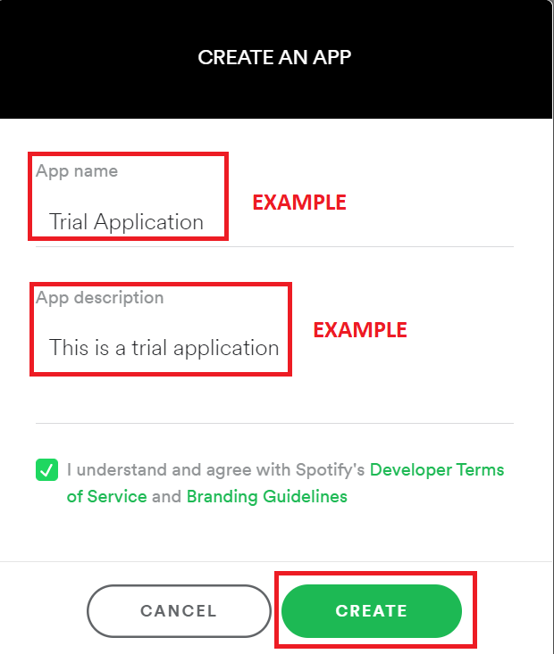

## Installation Guide

1.  Go to [Spotify Developers](https://developer.spotify.com/dashboard/login)
    and LogIn from your Spotify Account

2. After Logging In from your Spotify Account create a new Application

3. Click on `Create An App` and you will see this page

- An Example Image Has Been Provided

4. After clicking on `Create` you will be redirected to this page

- next in the
  [spotify developer dashboard](https://developer.spotify.com/dashboard/applications)
  click on your application and go to the settings tab

- here you should see a `callback` section

- in that please add the following url just as is `http://example.com/callback/`

5. Click on `SHOW CLIENT SECRET` highlighted in green text

6. Copy `Client ID` and `Client Secret` separately since they are needed later
   on

7. Now [clone](https://docs.github.com/en/repositories/creating-and-managing-repositories/cloning-a-repository)/[download](https://sites.northwestern.edu/researchcomputing/resources/downloading-from-github/) the repository and run the program

   - for linux you need root privileges to run the program
     - `$ sudo pip3 install -r requirements.txt`
     - `$ sudo python3 main.py`
   - for windows and mac permissions are set differently
     - `$ pip3 install -r requirements.txt`
     - `$ python3 main.py`
     - **Note: alias for python3 could be py or py3**

8. Now on running the program you would be asked to input

   - `buffer playlist`: this is the playlist where all the songs that you _like_ get saved
   - `client_id`: input client id from above step
   - `client_secret`: input client secret from above step

9. Now you will be redirected to a page asking for you to authorize the program
   accessing your spotify account information, please click agree

10. now copy the url to the page you are in

10. Paste this redirect url to the prompt asking for it in the terminal

11. The program should run well now, if facing any errors please open an issue
    on github
